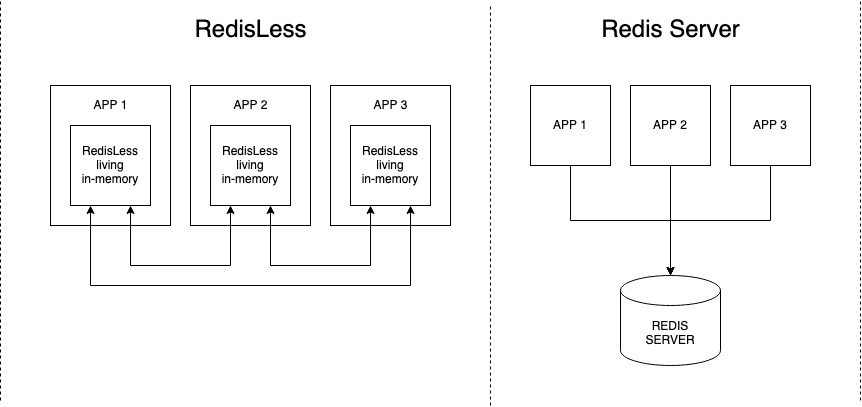

RedisLess
===========

[](https://discord.qovery.com) [](https://github.com/Qovery/RedisLess/actions?query=workflow%3A%22Test+and+Build%22) [](https://deps.rs/repo/github/Qovery/RedisLess)

---------

**THIS PROJECT IS NOT PRODUCTION READY YET!!**

---------

**RedisLess is a fast, lightweight, embedded and scalable in-memory Key/Value store library compatible with the [Redis](https://redis.io/topics/introduction) API.**

> RedisLess is the concatenation of Redis and Serverless.

The RedisLess project was initially announced [here](https://www.heapstack.sh/redisless-blazingly-fast-serverless-redis).

## Why
As developers, we often use Redis to share data and states between apps. The problem is that we need to set up a Redis server and manage it. Worst, scaling out Redis on multiple nodes is a nightmare. RedisLess brings you the ease of use of Redis without the inconvenience - directly from your code and without any server to manage.

What RedisLess is:

* Embedded in-memory. (No Redis server required!).
* Compatible with the Redis API (RESP).
* Not intrusive: you don't need to modify you code to use RedisLess!
* Built with DX and performance in mind.
* Cloud native friendly.

What RedisLess is not:

* Production ready yet.
* 1:1 Redis implementation.

# How to use it?

To use RedisLess, you only need to:

1. Install RedisLess library for your favorite language (see supported clients below).
2. Connect your favorite Redis client to `redis://localhost:16379`.
3. You don't need to change your code - RedisLess is Redis API compatible. (see [supported Redis commands](REDIS_FEATURES.md))

Under the hood, the RedisLess library starts a local Redis API compatible instance on port `16739` (you can change the port).

## NodeJS client

### Install
```bash
# RedisLess library with Python binding
npm install redisless

# redis client
npm install redis
```

### Usage
```js
/* in progress */
```

## Python client

### Install
```bash
# RedisLess library with Python binding
pip install redisless

# redis client
pip install redis
```

### Usage

```python
from redisless import RedisLess
import redis

redisless = RedisLess()

# start RedisLess embedded instance
redisless.start()

# Connect to RedisLess on localhost:16379
redis = redis.Redis(host='localhost', port=16379, db=0)

redis.set('foo', 'bar')
redis.get('foo')  # return bar 

# stop RedisLess embedded instance
redisless.stop()
```

# Features
- [ ] Redis API ([see implemented features](REDIS_FEATURES.md))
- [ ] Cluster mode
- [ ] Auto-discovery
- [ ] Disk persistence

# Supported clients
- [ ] NodeJS
- [ ] Golang
- [ ] Python
- [ ] Java

# How it works


# Performance
Strong attention to performance and code cleanliness is given when designing RedisLess. It aims to be crash-free, super-fast and put a minimum strain on your server resources (benchmarks will come soon).

RedisLess is written in Rust and export functions through FFI (Foreign Function Interface), making it usable from any language. We provide clients for NodeJS, Python, Golang, Java, and Rust. Supporting a new language can be done in 5 minutes. Look at [Python](clients/python) and [NodeJS](clients/nodejs) clients implementation for inspiration.

# Contribution welcome!
It is never too soon to contribute to a great project. If you are interested in contributing, please join us on [Discord](https://discord.qovery.com), then we can discuss. The project is in its early days, but we are serious about building a solid library to help thousands of developers.

# References

- Redis Internals: [Free e-book](https://redislabs.com/ebook)
- [Redis Protocol Specification](https://redis.io/topics/protocol) (RESP)
- [Sonic](https://github.com/valeriansaliou/sonic): fast and lightweight Elasticsearch alternative
